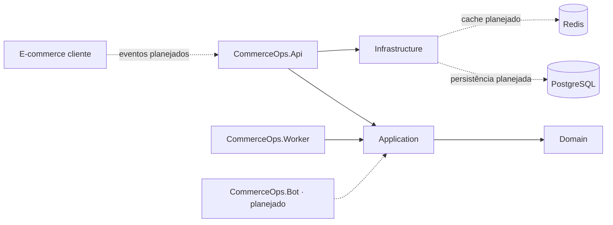

<a id="readme-top"></a>

<div align="center">

<pre>
╔══════════════════════════════════════════════╗
║              COMMERCEOPS GUARD               ║
║        monitor · diagnose · operate          ║
╚══════════════════════════════════════════════╝
</pre>

# CommerceOps Guard

### ChatOps defensivo e DBA Copilot para e-commerces

Backend externo para receber sinais operacionais, investigar inconsistências e, progressivamente, permitir operações controladas sem substituir as regras de negócio do e-commerce.

<p>
  
  
  
  
  
</p>

<p>
  
  
</p>

</div>

## Sobre o projeto

O CommerceOps Guard é uma plataforma backend de operação defensiva para e-commerces. A proposta é transformar eventos de pedidos, pagamentos, estoque, webhooks, filas e banco de dados em diagnósticos objetivos e casos operacionais auditáveis.

A primeira aplicação cliente planejada é a **Lumora**, um e-commerce Laravel + React. A integração será feita por eventos e endpoints protegidos: o CommerceOps Guard permanece isolado do banco da aplicação cliente.

> [!IMPORTANT]
> O estado atual corresponde ao bootstrap do projeto: solução .NET 8, separação inicial de projetos, endpoint de saúde e infraestrutura local com PostgreSQL e Redis. Recebimento de eventos, persistência, diagnóstico e bot ainda fazem parte do roadmap.

## O que este projeto resolve

O projeto é direcionado a incidentes operacionais que normalmente exigem investigação manual, como:

- pagamento aprovado com pedido ainda pendente;
- webhook duplicado ou não processado;
- estoque negativo, zerado ou baixado mais de uma vez;
- pedido criado sem itens ou sem movimentação esperada;
- job falhando ou fila parada;
- consulta lenta e possível padrão N+1;
- divergências entre o provedor externo e o estado local da loja.

O objetivo não é automatizar decisões críticas sem controle, mas reunir evidências, calcular risco e conduzir ações seguras com auditoria.

## Stack

| Tecnologia | Papel no projeto | Estado |
|---|---|---|
| [![.NET][dotnet-badge]][dotnet-url] | Runtime da solução | Em uso |
| [![ASP.NET Core][aspnet-badge]][aspnet-url] | API HTTP e health check | Em uso |
| [![PostgreSQL][postgres-badge]][postgres-url] | Persistência operacional | Infraestrutura preparada |
| [![Redis][redis-badge]][redis-url] | Cache e apoio ao processamento | Infraestrutura preparada |
| [![Docker][docker-badge]][docker-url] | Serviços locais reproduzíveis | Em uso |
| [![Worker Service][worker-badge]][dotnet-url] | Processamento em background | Estrutura preparada |
| [![Telegram][telegram-badge]][telegram-url] | Canal inicial de ChatOps | Planejado para o MVP |
| [![xUnit][xunit-badge]][xunit-url] | Testes automatizados | Em uso |

## Arquitetura inicial



As setas tracejadas representam integrações planejadas. Nesta fase, a API expõe apenas o health check e não acessa dados da Lumora.

## Estrutura do repositório

```text
commerceops-guard/
├── src/
│   ├── CommerceOps.Api/              # API HTTP
│   ├── CommerceOps.Application/      # casos de uso e orquestração
│   ├── CommerceOps.Bot/              # host do canal ChatOps futuro
│   ├── CommerceOps.Contracts/        # contratos compartilhados
│   ├── CommerceOps.Domain/           # domínio e regras de negócio
│   ├── CommerceOps.Infrastructure/   # persistência e integrações
│   └── CommerceOps.Worker/           # processamento em background
├── tests/
│   ├── CommerceOps.IntegrationTests/
│   └── CommerceOps.UnitTests/
├── .env.example
├── docker-compose.yml
└── CommerceOpsGuard.sln
```

## Como executar localmente

### Pré-requisitos

- .NET SDK 8;
- Docker com Docker Compose.

### Ambiente

```bash
cp .env.example .env
docker compose up -d
```

### API

```bash
dotnet restore
dotnet run --project src/CommerceOps.Api -- --urls http://localhost:5000
```

### Build e testes

```bash
dotnet build
dotnet test
```

Para encerrar os serviços locais:

```bash
docker compose down
```

## Health check

Com a API em execução:

```bash
curl -i http://localhost:5000/health
```

Resposta esperada:

```http
HTTP/1.1 200 OK
Content-Type: application/json

{"status":"healthy"}
```

> [!NOTE]
> O health check atual confirma a disponibilidade da API. Verificações de PostgreSQL e Redis ainda não foram conectadas ao endpoint.

## Segurança

> [!WARNING]
> O CommerceOps Guard não é um console SQL remoto e não deve contornar as regras de domínio do e-commerce cliente.

- não executa SQL livre;
- não conecta diretamente ao banco da Lumora;
- ações sensíveis exigirão confirmação antes da execução;
- credenciais e secrets devem permanecer em variáveis de ambiente;
- o arquivo `.env` real não deve ser versionado;
- operações futuras deverão usar endpoints protegidos, idempotência e trilha de auditoria.

## Roadmap curto

- [x] Bootstrap da solução .NET 8, projetos, health check e Docker Compose.
- [ ] Cadastro de aplicações clientes e recebimento de eventos com HMAC.
- [ ] Persistência de eventos no PostgreSQL.
- [ ] Casos operacionais, evidências e classificação de risco.
- [ ] Bot Telegram consultivo para o MVP.
- [ ] Integração inicial com a Lumora por API protegida.
- [ ] Diagnósticos e ações seguras com confirmação e auditoria.

## Contato

- GitHub: [auhauhbr](https://github.com/auhauhbr)
- Portfólio: [jeffersontadeu.vercel.app](https://jeffersontadeu.vercel.app)
- LinkedIn: [Jefferson Tadeu dos Santos](https://www.linkedin.com/in/jefferson-tadeu-dos-santos-0ab133380)

<p align="right">(<a href="#readme-top">voltar ao topo</a>)</p>

[dotnet-badge]: https://img.shields.io/badge/.NET-8-512BD4?style=for-the-badge&logo=dotnet&logoColor=white
[dotnet-url]: https://dotnet.microsoft.com/
[aspnet-badge]: https://img.shields.io/badge/ASP.NET_Core-API-512BD4?style=for-the-badge&logo=dotnet&logoColor=white
[aspnet-url]: https://learn.microsoft.com/aspnet/core/
[postgres-badge]: https://img.shields.io/badge/PostgreSQL-16-4169E1?style=for-the-badge&logo=postgresql&logoColor=white
[postgres-url]: https://www.postgresql.org/
[redis-badge]: https://img.shields.io/badge/Redis-7-DC382D?style=for-the-badge&logo=redis&logoColor=white
[redis-url]: https://redis.io/
[docker-badge]: https://img.shields.io/badge/Docker-Compose-2496ED?style=for-the-badge&logo=docker&logoColor=white
[docker-url]: https://www.docker.com/
[worker-badge]: https://img.shields.io/badge/Worker_Service-background-0B1929?style=for-the-badge&logo=dotnet&logoColor=white
[telegram-badge]: https://img.shields.io/badge/Telegram_Bot_API-planned-26A5E4?style=for-the-badge&logo=telegram&logoColor=white
[telegram-url]: https://core.telegram.org/bots/api
[xunit-badge]: https://img.shields.io/badge/xUnit-tests-512BD4?style=for-the-badge
[xunit-url]: https://xunit.net/
