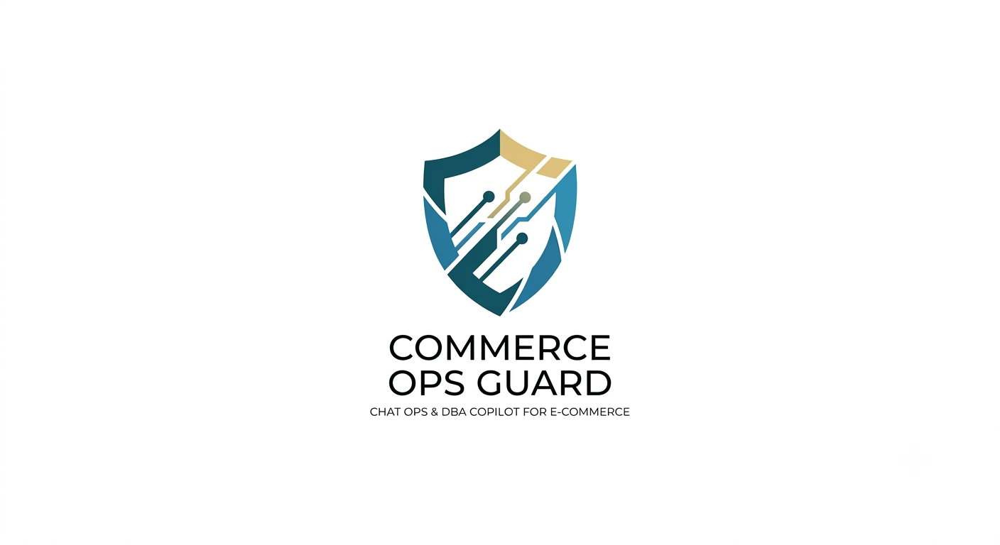
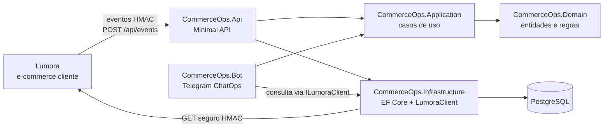

<a id="readme-top"></a>

<div align="center">



<pre>
╔══════════════════════════════════════════════╗
║              COMMERCEOPS GUARD              ║
║        monitor · diagnose · approve         ║
╚══════════════════════════════════════════════╝
</pre>

# CommerceOps Guard

### ChatOps defensivo para diagnóstico e aprovação de ações operacionais em e-commerce

O CommerceOps Guard é uma camada operacional externa para receber eventos, diagnosticar inconsistências, consultar a Lumora por API segura e conduzir ações com aprovação explícita pelo admin no Telegram.

<p>
  
  
  
  
  
  
</p>

<p>
  
  
</p>

</div>

## Sobre

O CommerceOps Guard nasceu para resolver um problema comum em operações de e-commerce: quando pedido, pagamento, estoque, webhooks e filas entram em estados divergentes, a investigação costuma ser manual, demorada e arriscada.

Este projeto atua como uma camada externa e segura. Ele não substitui as regras de negócio da loja e não acessa diretamente o banco da Lumora. Em vez disso, recebe eventos assinados, consulta endpoints internos protegidos da Lumora, monta diagnósticos e permite que um admin aprove ou cancele ações pendentes pelo Telegram.

Neste estágio, o projeto já possui:

- API em .NET 8 com Minimal APIs;
- persistência operacional com Entity Framework Core e PostgreSQL;
- ingestão de eventos protegida por HMAC;
- criação de casos operacionais a partir de regras de domínio;
- integração HTTP segura com a Lumora;
- diagnóstico de pedido por endpoint interno;
- bot Telegram para ChatOps;
- geração de rascunho de mensagem ao cliente;
- fluxo de ActionRequest para aprovação/cancelamento de ações;
- testes unitários e de integração.

> [!IMPORTANT]
> O envio real de e-mail ainda não foi implementado. O sistema cria rascunhos e ActionRequests aprováveis, mas não chama Gmail API, SMTP ou endpoint de envio da Lumora nesta etapa.

## Problemas Que O Projeto Endereça

O CommerceOps Guard foi pensado para incidentes como:

- pedido pendente sem pagamento aprovado;
- pagamento aprovado com pedido ainda pendente;
- pedido cancelado com pagamento aprovado;
- divergência entre status local e provedor externo;
- estoque inconsistente;
- webhook duplicado, ausente ou não processado;
- criação automática de casos operacionais com evidências;
- necessidade de aprovação humana antes de qualquer ação sensível.

## Arquitetura



### Projetos

```text
src/
├── CommerceOps.Api/              # API HTTP, eventos, health, integrações Lumora
├── CommerceOps.Application/      # contratos, casos de uso, composer de mensagens, actions
├── CommerceOps.Bot/              # bot Telegram e roteamento de comandos
├── CommerceOps.Contracts/        # contratos compartilhados
├── CommerceOps.Domain/           # entidades de domínio
├── CommerceOps.Infrastructure/   # EF Core, migrations, LumoraClient, persistência
└── CommerceOps.Worker/           # worker background preparado

tests/
├── CommerceOps.UnitTests/
└── CommerceOps.IntegrationTests/
```

## Stack

| Tecnologia | Uso no projeto |
|---|---|
| .NET 8 | runtime principal |
| ASP.NET Core Minimal APIs | API HTTP do CommerceOps |
| Entity Framework Core 8 | mapeamento e persistência |
| PostgreSQL 16 | banco operacional em produção/local |
| SQLite in-memory | testes de integração |
| HttpClientFactory | integração HTTP com Lumora |
| HMAC SHA-256 | assinatura de eventos recebidos e chamadas à Lumora |
| Telegram Bot API | interface ChatOps para admins |
| xUnit | testes unitários e de integração |
| Docker Compose | PostgreSQL e Redis locais |

Redis está disponível no `docker-compose.yml`, mas ainda não é parte essencial do fluxo implementado.

## API Implementada

### Health

```http
GET /health
```

Retorna:

```json
{ "status": "healthy" }
```

### Eventos Operacionais

```http
POST /api/events
```

Recebe eventos da aplicação cliente. A requisição exige:

- `X-CommerceOps-App`
- `X-CommerceOps-Timestamp`
- `X-CommerceOps-Signature`

A API valida janela de replay, app ativo e assinatura HMAC antes de persistir o evento e avaliar regras operacionais.

### Casos Operacionais

```http
GET /api/cases
GET /api/cases/{id}
```

Lista e detalha casos criados a partir dos eventos recebidos.

### Integração Lumora

```http
GET /api/integrations/lumora/health
GET /api/integrations/lumora/orders/{id}/diagnostic
```

O diagnóstico interno consulta a Lumora em:

```http
GET /commerceops/orders/{id}/diagnostic
```

A assinatura HMAC da chamada fica encapsulada no `LumoraClient`. A API e o bot não duplicam lógica de assinatura.

Campos esperados no diagnóstico:

- `order_id`
- `status`
- `payment_status`
- `stock_status`
- `findings`
- `summary`
- `risk`
- `order_number`
- `total`
- `subtotal`
- `shipping_value`
- `created_at`
- `updated_at`
- `items`

## Bot Telegram

O bot é um host .NET que usa polling da Telegram Bot API. O acesso é restrito por `TELEGRAM_ALLOWED_ADMIN_IDS` ou pela seção `Telegram:AllowedAdminIds`.

Comandos atuais:

```text
/start
/help
/resumo
/casos
/case {id}
/pedido {id}
/mensagem-pedido {id}
/msg-pedido {id}
/preparar-mensagem-pedido {id}
/acoes
/confirmar-acao {id}
/cancelar-acao {id}
```

### Diagnóstico de Pedido

```text
/pedido 1
```

Consulta a Lumora via `ILumoraClient` e responde de forma compacta:

```text
Pedido #1 — Diagnóstico Lumora

Status do pedido: pending_payment
Pagamento: pending
Estoque: ok
Risco: low

Achados:
1. pending_order_without_approved_payment
   Order is pending and does not have an approved payment.

Itens:
- Ponto De Acesso Ubiquiti UniFi U6+ Wi-Fi 6 Interno
  qtd: 1
  total: R$ 899.00
  estoque atual: 8

Resumo:
1 operational finding(s) detected.
```

### Rascunho de Mensagem

```text
/mensagem-pedido 1
/msg-pedido 1
```

Gera um rascunho seguro, sem enviar nada:

```text
Rascunho de mensagem para cliente — Pedido #1

Canal sugerido: email
Assunto: Atualização sobre seu pedido #1

Mensagem:
Olá! Identificamos que seu pedido #1 foi criado com sucesso e ainda está aguardando confirmação de pagamento.

Status:
Rascunho gerado. Nenhuma mensagem foi enviada.
```

O serviço responsável é `CustomerMessageDraftService`, que hoje possui templates para:

- `pending_order_without_approved_payment`
- `order_paid_but_pending`
- `cancelled_order_with_approved_payment`
- fallback genérico

### ActionRequests

```text
/preparar-mensagem-pedido 1
```

Consulta o diagnóstico, gera o rascunho e cria uma ação pendente no banco:

```text
Ação pendente criada: ACT-00001

Tipo: customer_message_email
Pedido: #1
Risco: low
Status: pending_approval

Assunto:
Atualização sobre seu pedido #1

Mensagem:
Olá! Identificamos que seu pedido #1 foi criado com sucesso...

Nenhuma mensagem foi enviada.

Para confirmar:
 /confirmar-acao ACT-00001

Para cancelar:
 /cancelar-acao ACT-00001
```

Outros comandos:

```text
/acoes
/confirmar-acao ACT-00001
/cancelar-acao ACT-00001
```

Confirmar uma ActionRequest muda o status para `approved`, registra quem confirmou e quando confirmou, mas ainda não executa envio real. Cancelar muda o status para `cancelled`.

## Modelo De Dados Principal

Entidades principais:

- `ClientApplication`
- `OperationalEvent`
- `OperationalCase`
- `CaseFinding`
- `ActionRequest`

`ActionRequest` guarda:

- `PublicId`, exemplo `ACT-00001`;
- `Type`, exemplo `customer_message_email`;
- `Status`, exemplo `pending_approval`, `approved`, `cancelled`;
- entidade relacionada, exemplo `order` e `1`;
- risco e motivo;
- `PayloadJson` com `channel`, `subject`, `body`, `order_id`, `order_number`, `findings` e `warning`;
- chat ID de criação, aprovação e cancelamento;
- timestamps de criação, aprovação, cancelamento e execução futura.

O payload não deve armazenar segredos, assinatura HMAC, token do Telegram, URL privada, headers ou dados sensíveis desnecessários.

## Segurança

Princípios adotados:

- o CommerceOps não acessa diretamente o banco da Lumora;
- chamadas para a Lumora passam pelo `LumoraClient`;
- assinatura HMAC fica encapsulada no cliente de infraestrutura;
- eventos recebidos são validados com HMAC e janela anti-replay;
- bot exige admin autorizado;
- respostas não expõem stack trace, segredo, assinatura ou URL sensível;
- ações sensíveis passam por aprovação explícita;
- envio real de e-mail ainda não existe nesta fase.

## Como Executar Localmente

### Pré-requisitos

- .NET SDK 8;
- Docker com Docker Compose.

### Subir infraestrutura

```bash
cp .env.example .env
docker compose up -d
```

### API

```bash
dotnet restore
dotnet run --project src/CommerceOps.Api -- --urls http://localhost:5073
```

Teste:

```bash
curl -i http://localhost:5073/health
curl -i http://localhost:5073/api/integrations/lumora/health
curl -i http://localhost:5073/api/integrations/lumora/orders/1/diagnostic
```

### Bot Telegram

Configure variáveis de ambiente:

```bash
export TELEGRAM_BOT_TOKEN="seu-token"
export TELEGRAM_ALLOWED_ADMIN_IDS="123456789"
```

Execute:

```bash
dotnet run --project src/CommerceOps.Bot
```

### Lumora

Para integrar com a Lumora, configure:

```bash
export LUMORA_APP_ID="commerceops"
export LUMORA_BASE_URL="https://sua-lumora"
export LUMORA_SHARED_SECRET="segredo-compartilhado"
```

Também é possível usar as seções `Lumora` e `ClientApplicationSeed` em `appsettings`, mantendo segredos reais fora do repositório.

## Build E Testes

```bash
dotnet build CommerceOpsGuard.sln --no-restore /m:1
dotnet test CommerceOpsGuard.sln --no-build --no-restore /m:1 -p:BuildInParallel=false
```

Testes cobrem:

- validação HMAC;
- autorização de admin Telegram;
- roteamento de comandos do bot;
- cliente Lumora;
- endpoints de health, eventos, casos e diagnóstico;
- criação, listagem, aprovação e cancelamento de ActionRequests;
- persistência com EF Core em testes de integração.

## Estado Atual

Concluído:

- [x] solução .NET 8 organizada por API, Application, Domain, Infrastructure, Bot e Worker;
- [x] Docker Compose com PostgreSQL e Redis;
- [x] ingestão de eventos com HMAC;
- [x] persistência de eventos e casos operacionais;
- [x] regras iniciais para criação de casos;
- [x] endpoints de casos;
- [x] cliente Lumora com HMAC;
- [x] endpoint interno de diagnóstico de pedido;
- [x] bot Telegram consultivo;
- [x] rascunho de mensagem ao cliente;
- [x] ActionRequests com aprovação/cancelamento;
- [x] testes unitários e de integração.

Próximas fases:

- [ ] Lumora expor endpoint seguro de envio real de e-mail;
- [ ] CommerceOps executar ActionRequest aprovada chamando esse endpoint;
- [ ] registrar auditoria de execução;
- [ ] proteger contra reenvio duplicado;
- [ ] ampliar tipos de ações operacionais;
- [ ] evoluir Worker para processamento assíncrono de ações.

## Texto Para LinkedIn

```text
Estou desenvolvendo o CommerceOps Guard, um projeto em .NET 8 para ChatOps defensivo em e-commerce.

A ideia é criar uma camada operacional externa que ajuda a diagnosticar inconsistências entre pedidos, pagamentos, estoque, webhooks e filas, sem acessar diretamente o banco da loja e sem burlar as regras de negócio do sistema principal.

O projeto já conta com:

- API em ASP.NET Core Minimal APIs;
- Entity Framework Core com PostgreSQL;
- ingestão de eventos com assinatura HMAC;
- criação de casos operacionais com evidências;
- integração segura com a Lumora, um e-commerce Laravel + React;
- endpoint interno para diagnóstico de pedidos;
- bot Telegram para admins;
- comandos como /pedido, /mensagem-pedido, /preparar-mensagem-pedido, /acoes, /confirmar-acao e /cancelar-acao;
- geração de rascunhos de mensagem ao cliente;
- fluxo de ActionRequest para aprovar ou cancelar ações antes de qualquer execução;
- testes unitários e de integração com xUnit.

Um exemplo prático: o bot consegue consultar um pedido na Lumora, mostrar status do pedido, pagamento, estoque, risco, achados operacionais e itens. A partir disso, ele gera um rascunho de mensagem para o cliente e cria uma ação pendente, que o admin pode aprovar ou cancelar pelo Telegram.

Nesta fase, o sistema ainda não envia e-mails reais. Essa foi uma decisão arquitetural: o CommerceOps prepara e aprova a ação, mas o envio real deve ser feito futuramente pela Lumora, por um endpoint seguro e auditado, já que é ela quem possui os dados do cliente, templates e configuração de mailer.

Tecnologias usadas:
.NET 8, ASP.NET Core, EF Core, PostgreSQL, Docker Compose, HttpClientFactory, HMAC SHA-256, Telegram Bot API e xUnit.

O objetivo do projeto é explorar uma arquitetura segura para operação de e-commerce: diagnosticar rápido, reduzir investigação manual e colocar aprovação humana antes de qualquer ação sensível.
```

## Contato

- GitHub: [auhauhbr](https://github.com/auhauhbr)
- Portfólio: [jeffersontadeu.vercel.app](https://jeffersontadeu.vercel.app)
- LinkedIn: [Jefferson Tadeu dos Santos](https://www.linkedin.com/in/jefferson-tadeu-dos-santos-0ab133380)

<p align="right">(<a href="#readme-top">voltar ao topo</a>)</p>
